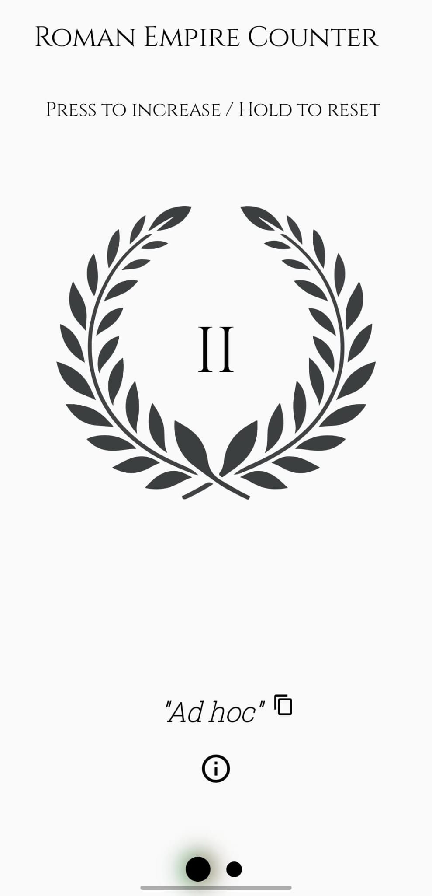
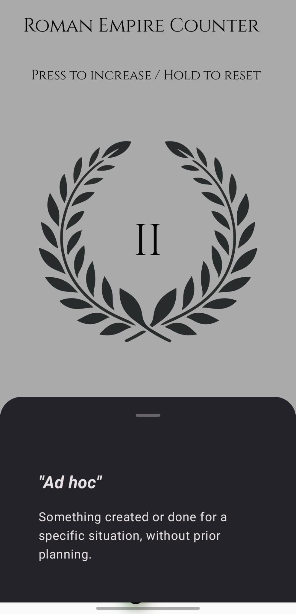
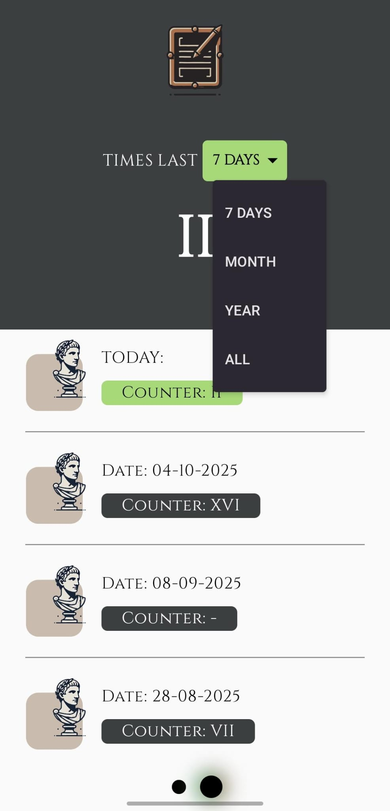

# 🏛️ Roman Empire Counter

A fun Android app that helps you track how many times you think about the Roman Empire each day! Built with modern Android development practices, this app demonstrates Clean Architecture principles and provides a delightful user experience.

[](https://play.google.com/store/apps/details?id=com.blas.romanempirecounter&hl=en)

## 📱 About

Have you ever wondered how often you think about the Roman Empire? This app lets you track those moments! Each time you think about the Roman Empire, simply open the app and increase the counter. The app keeps a complete history of your daily counts and provides weekly summaries to help you understand your Roman Empire thinking patterns.

## ✨ Features

- **Daily Counter**: Easily increment the counter each time you think about the Roman Empire
- **Weekly Summary**: View your weekly statistics and patterns
- **Complete History**: Browse through all your recorded days with detailed information
- **Beautiful UI**: Modern Material Design 3 interface with Roman Empire-themed aesthetics
- **Home Widget**: Quick access widget to view your count without opening the app
- **Latin Quotes**: Inspirational quotes in Latin and English/Spanish to enhance the experience
- **Data Privacy**: All data is stored locally on your device - no data collection or sharing

## 🎯 Download

Get the app from Google Play Store:

[](https://play.google.com/store/apps/details?id=com.blas.romanempirecounter&hl=en)

## 🏗️ Architecture

This project follows **Clean Architecture** principles, ensuring separation of concerns and maintainability:

- **Presentation Layer**: Jetpack Compose UI with MVVM pattern
- **Domain Layer**: Business logic and use cases
- **Data Layer**: Room database for local persistence

### Tech Stack

- **Language**: Kotlin
- **UI Framework**: Jetpack Compose
- **Architecture**: Clean Architecture (Presentation, Domain, Data layers)
- **Dependency Injection**: Hilt
- **Database**: Room
- **Navigation**: Navigation Compose
- **Widgets**: Glance AppWidget
- **Material Design**: Material 3

### Key Libraries

- Jetpack Compose
- Room Database
- Hilt (Dependency Injection)
- Navigation Compose
- Glance (App Widgets)
- Material Icons Extended

## 📂 Project Structure

```
app/src/main/java/com/blas/romanempirecounter/
├── data/
│   ├── local/
│   │   ├── dao/          # Room DAOs
│   │   ├── database/     # Room database setup
│   │   └── entity/       # Room entities
│   └── repository/       # Repository implementations
├── domain/
│   ├── model/            # Domain models
│   ├── repository/       # Repository interfaces
│   └── usecase/          # Use cases
├── presentation/
│   ├── mainpage/         # Main screen with counter
│   ├── secondScreen/     # History and statistics screen
│   ├── composables/      # Reusable composables
│   └── ui/theme/         # App theming
└── di/                   # Dependency injection modules
```

## 🚀 Getting Started

### Prerequisites

- Android Studio Hedgehog or later
- JDK 17 or higher
- Android SDK (minSdk 26, targetSdk 34)

### Installation

1. Clone the repository:
```bash
git clone https://github.com/slab10000/Android_App_Clean_Architecture-RomanEmpireCounter.git
```

2. Open the project in Android Studio

3. Sync Gradle files

4. Run the app on an emulator or physical device

## 📺 Video Content

I documented the entire development process on TikTok and YouTube:

- **TikTok**: [@blas.ml](https://www.tiktok.com/@blas.ml)
  - [App Explanation Video](https://www.tiktok.com/@blas.ml/video/7417778347104685345)
- **YouTube**: [@BlasMorenoLaguna](https://www.youtube.com/@BlasMorenoLaguna)

Check out my content to see the app development journey, architecture decisions, and implementation details!

## 🎨 Screenshots

### Main Screen - Counter


The main screen features a large laurel wreath counter displaying Roman numerals. Users can press to increase the counter or hold to reset.

### Main Screen - Latin Quote


The screen displays inspirational Latin phrases with their definitions, enhancing the Roman Empire experience.

### History Screen


The history screen shows all your recorded days with a filter option (7 Days, Month, Year, or All). Each entry displays the date and the counter value in Roman numerals, with today's entry highlighted in green.

## 📊 App Information

- **Package Name**: `com.blas.romanempirecounter`
- **Min SDK**: 26 (Android 8.0)
- **Target SDK**: 34 (Android 14)
- **Version**: 1.8
- **Content Rating**: Everyone

## 🔒 Privacy

This app:
- ✅ Stores all data locally on your device
- ✅ Does not collect any personal information
- ✅ Does not share data with third parties
- ✅ Does not require internet connection for core functionality

## 🤝 Contributing

Contributions, issues, and feature requests are welcome! Feel free to check the [issues page](https://github.com/slab10000/Android_App_Clean_Architecture-RomanEmpireCounter/issues).

## 👨‍💻 Author

**Blas Moreno Laguna**

- Email: blasmorenolaguna@gmail.com
- TikTok: [@blas.ml](https://www.tiktok.com/@blas.ml)
- YouTube: [@BlasMorenoLaguna](https://www.youtube.com/@BlasMorenoLaguna)

⭐ If you find this project interesting, please consider giving it a star!
